<h1 align="center">基于SpringBoot的零食商城系统</h1>

- <b>完整代码获取地址：从戎源码网 ([https://armycodes.com/](https://armycodes.com/))</b>
- <b>技术探讨、资料分享，请加QQ群：692619798</b>
- <b>作者微信：19941326836  QQ：952045282</b>
- <b>承接计算机毕业设计、Java毕业设计、Python毕业设计、深度学习、机器学习</b>
- <b>选题+开题报告+任务书+程序定制+安装调试+论文+答辩ppt 一条龙服务</b>
- <b>所有选题地址 ([https://github.com/Descartes007/allProject](https://github.com/Descartes007/allProject)) </b>

## 一、项目介绍

基于SpringBoot的零食商城系统，系统角色为 管理员（后台）、顾客（前台）和供应商/采购，主要功能如下
### 管理员：
- 基本操作：登录、修改密码、获取/修改个人信息
- 商品管理：商品添加、修改、删除、上下架、设定是否新品、管理库存/最低库存、商品图片、按名称/分类/品牌搜索、按分类/品牌/规格统计与查询
- 分类/品牌/规格管理：新增/编辑/删除/名称检查、获取列表
- 订单管理：查看订单列表、订单详情（含物流）、修改订单状态（发货/确认收货/删除）、订单统计
- 采购与供应商：供应商 CRUD、采购记录管理、采购收货（入库并更新库存）
- 购物车与下单管理：管理用户购物车、支持购物车下单、临时订单信息写入 Redis
- 用户与权限管理：查询用户列表（顾客/管理员）、删除用户、角色授权（user-role 管理）、VIP 管理（添加/续期/删除）
- 营销与评价：轮播图（Banner）管理、商品评价管理
### 顾客（前台用户）：
- 账户：注册、登录、找回密码、个人中心（信息查看/修改）
- 商品浏览：商城首页、分类/品牌/关键字搜索、商品详情查看
- 购物车：加入购物车、修改数量、删除、查看
- 下单与支付：单品购买或购物车合并下单（支持将订单信息临时存 Redis）、调用支付（集成支付宝 SDK）
- 订单：查看我的订单、订单详情、确认收货、申请退货/查看退货进度
- 评价与会员：商品评价、购买/管理 VIP（会员购买与过期控制）
### 供应商 / 采购角色：
- 供应商信息管理：供应商列表/新增/修改/删除/启用状态
- 采购记录：添加采购、查看采购列表、采购收货（更新商品库存）

## 二、项目技术

- 编程语言：Java
- 项目架构：B/S 架构
- 前端技术：
- Vue 2.x、Vue Router、Vuex，Element UI，Axios、qs（表单序列化，ECharts / v-charts、nprogress
- 后端技术：Spring Boot 2.3.x（MVC）、Spring AOP、，MyBatis-Plus、MySQL，Redis、阿里短信、支付宝 SDK（支付）

## 三、运行环境

- JDK版本：1.8及以上都可以
- 操作系统：Windows7/10、MacOS
- 开发工具：IDEA、Ecplise、MyEclipse都可以

## 四、数据库配置文件

- npm版本：6.14.13及以上都可以
- Redis版本：3.2.100及以上都可以
- 文件名：application.yml、application-jdbc.yml、application-mail.yml、application-redis.yml
- 编码类型：utf8

## 论文截图

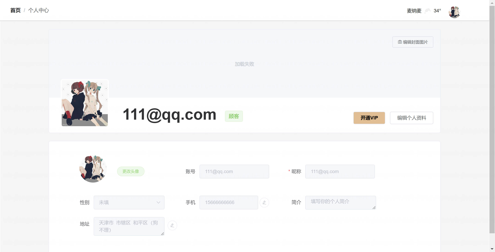

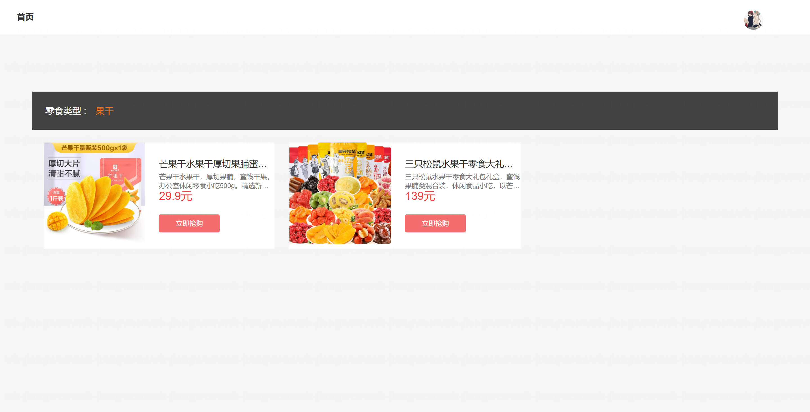

## 系统截图

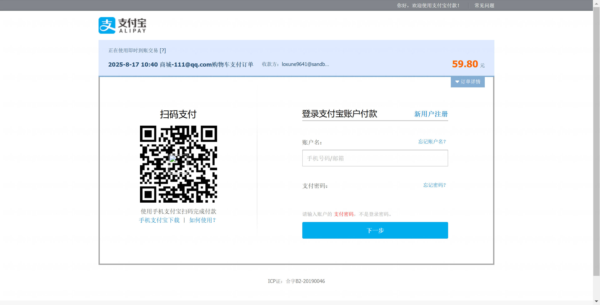

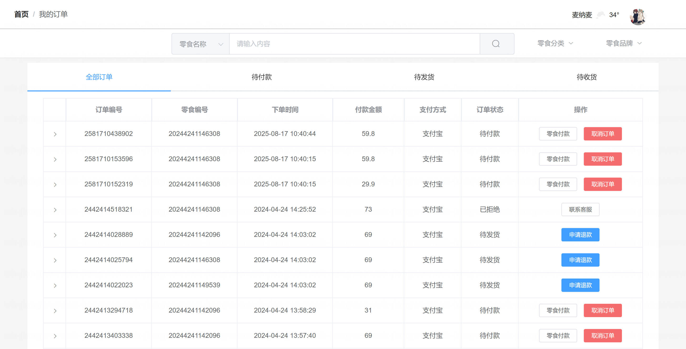

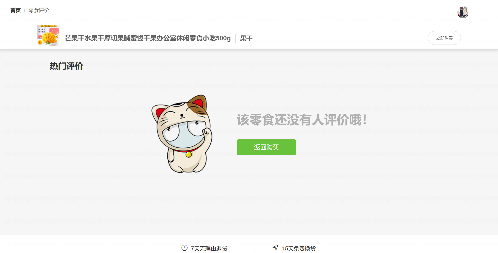

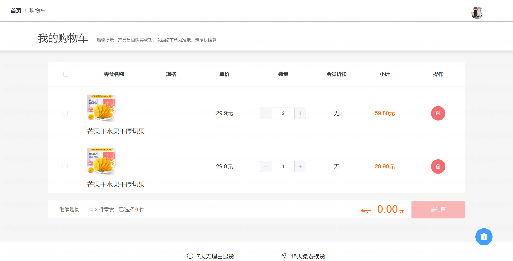

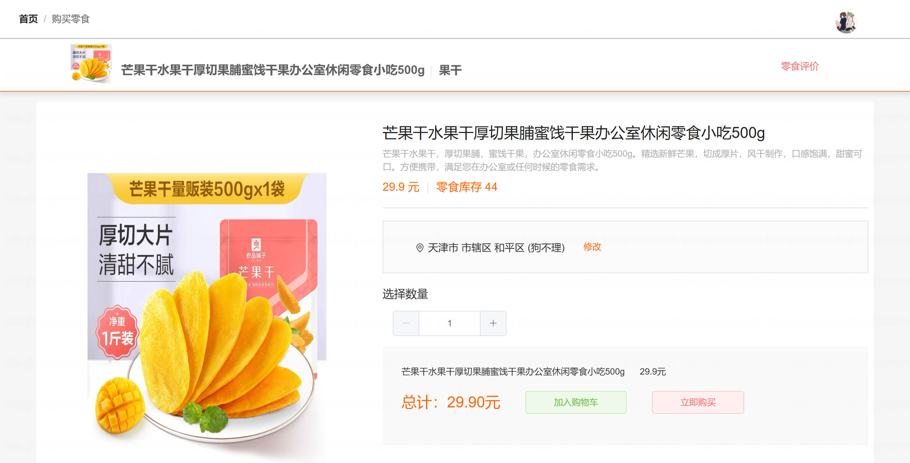

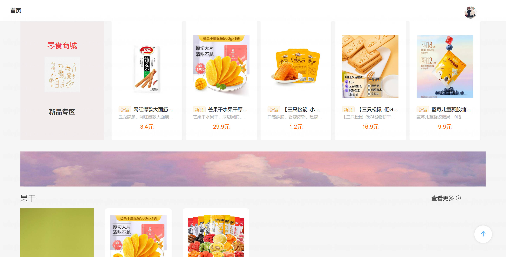

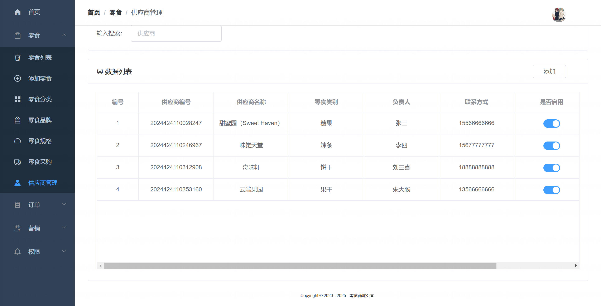

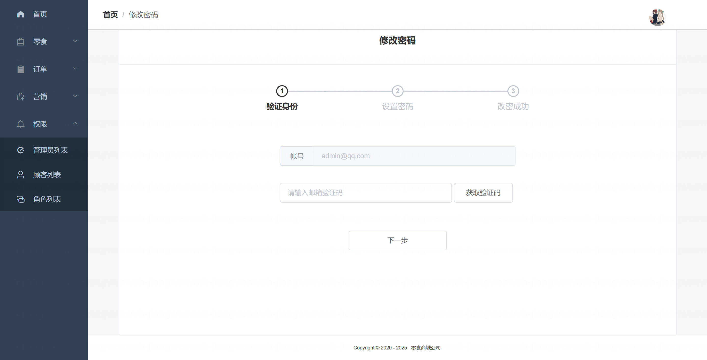

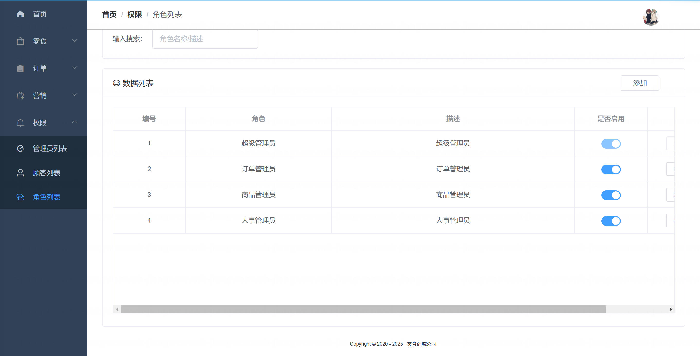
